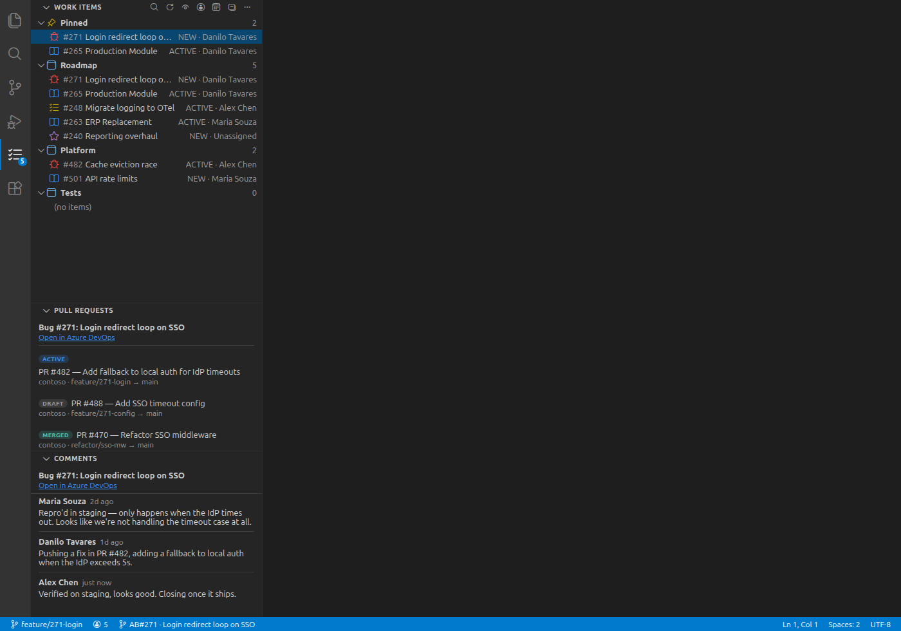
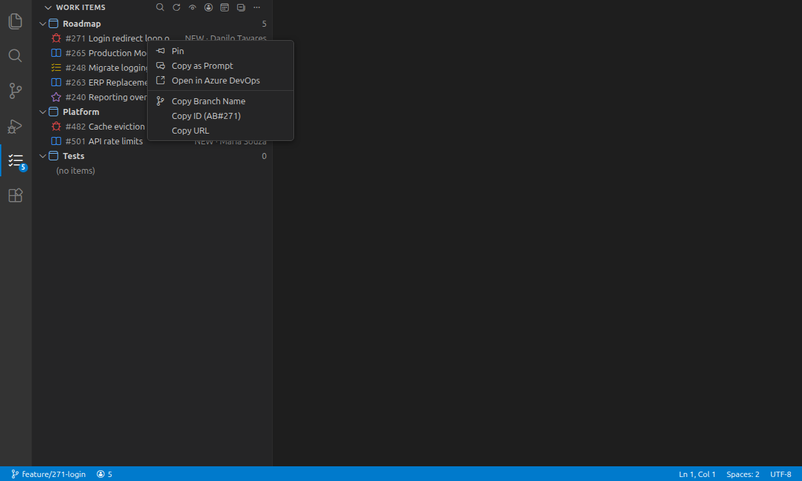
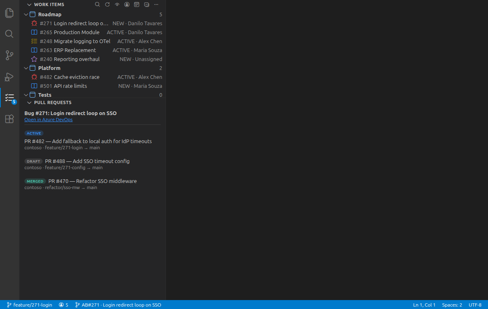
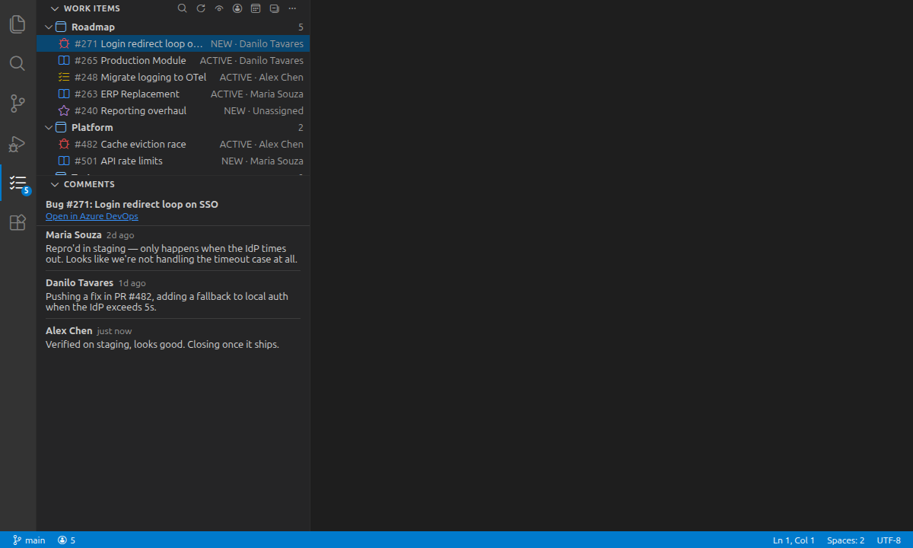
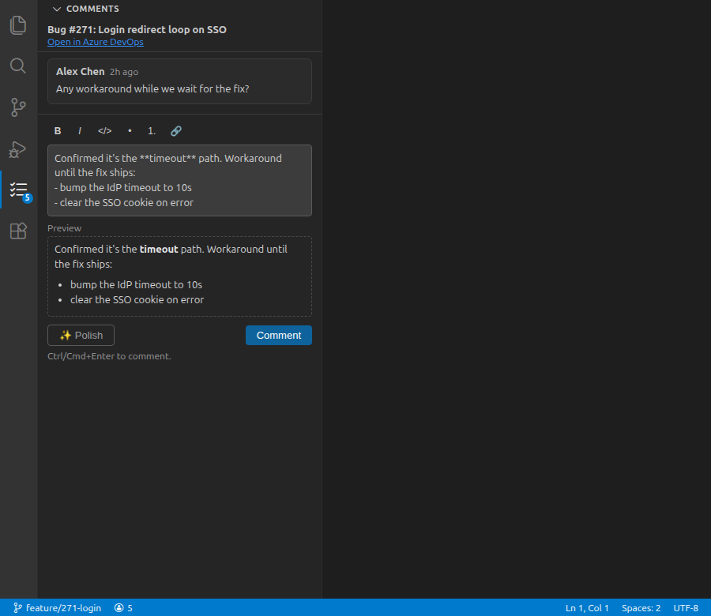
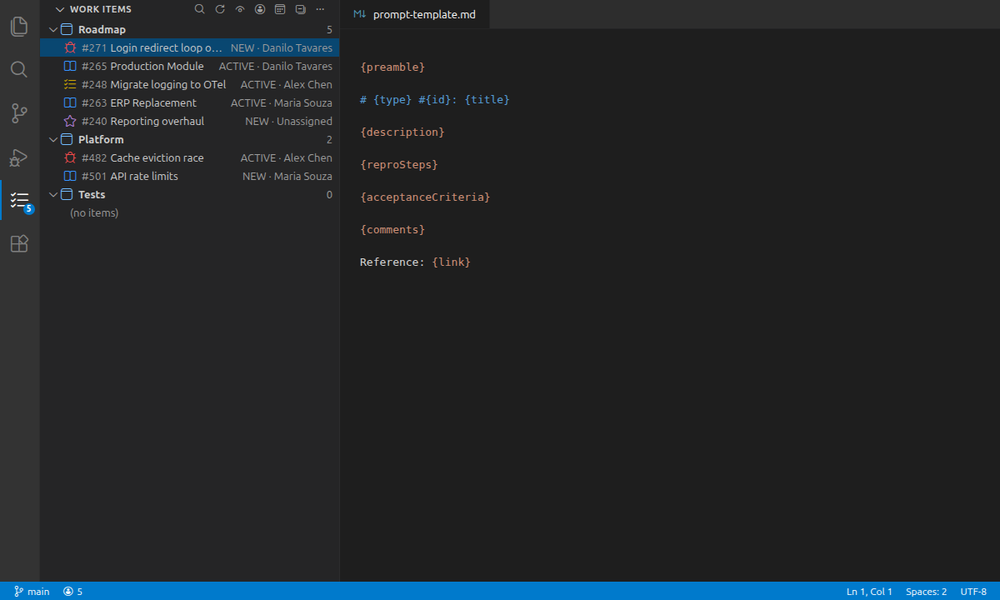

# Azure Boards Inbox

> Your Azure DevOps work items, in VS Code's sidebar.



A focused inbox for the work items on your plate — across every project — without leaving the editor. Read-only by default; commenting is opt-in.

## Features

- **All your items, one tree** — assigned to you across every project, grouped, counted, and filterable
- **Pull requests & comments** that follow your selection — comments render formatting and **inline images**
- **Add comments** (opt-in) — a Markdown composer with live preview, and optional **Polish with AI** using *your own* model
- **Copy as Prompt** — formatted Markdown for Copilot / Claude Code / any AI chat (template is editable)
- **Branch-aware status bar** — check out `bug/1234-fix-login` and it shows `AB#1234 · <title>`
- **One-click** copy of branch name / `AB#1234` / URL, or open in Azure DevOps

## Quick start

1. Click the **Azure Boards** icon in the activity bar → **Sign in**.
2. Paste your org URL and a [Personal Access Token](https://learn.microsoft.com/azure/devops/organizations/accounts/use-personal-access-tokens-to-authenticate). Default scopes: *Work Items: Read* and *Project and Team: Read*. The token is stored encrypted in VS Code's `SecretStorage`.
3. **⋯ → Manage Subscriptions** to pick the projects you care about.

That's it — your items show up in the tree.

## Work items

Everything assigned to you, grouped by project with live counts. **Pin** the items you're actively working on to a section at the top, and filter from the title bar (show closed, all assignees, current iteration only).

Each row has inline actions and a right-click menu: **Pin**, **Copy as Prompt**, **Open in Azure DevOps**, **Copy Branch Name**, **Copy ID** (`AB#1234`), **Copy URL**.



## Pull requests

Every PR linked to the selected work item, with a status pill (Draft / Active / Merged / Abandoned) and `repo · source → target`. Click to open in the browser.



## Comments

The discussion thread for the selected item, refreshed as you change selection. Each comment is a card with its **formatting intact** (bold, lists, code) and **images rendered inline** — Azure DevOps attachment images are auth-gated, so the extension loads them through your token instead of showing broken links.



## Adding comments

Replying is **off by default** so the extension only ever needs a read-only token. When you want it, turn it on — once — and a composer appears under the thread.



**Enable it.** Run **Azure Boards: Enable Adding Comments** (or click *Enable adding comments* in the Comments view, or flip `azureBoards.enableComments`). You'll be prompted for a Personal Access Token with **Work Items: Read & Write** — this replaces your token in place (write is a superset of read, so everything keeps working).

**Write it.** Draft in Markdown with the toolbar — **bold**, *italic*, `code`, bulleted/numbered lists, links — and watch the **live preview** render exactly what will be posted. Undo/redo works as expected. Post with **Ctrl/Cmd+Enter** or the **Comment** button.

**Polish it (optional).** A **Polish** button cleans up grammar, clarity, and formatting:

- It uses **your own model** — the editor's Language Model API (e.g. GitHub Copilot) when present, otherwise an **OpenAI-compatible** endpoint you configure. **Only your draft is sent**, and nothing goes to the extension author.
- **Using Cursor (or any editor without a built-in model)?** Run *Azure Boards: Set AI API Key*, then set `azureBoards.ai.baseUrl` and `azureBoards.ai.model`. Any `/chat/completions` endpoint works — OpenAI, OpenRouter, Groq, or a local Ollama/LM Studio server.
- It **rewrites in place** for you to review before posting; it never posts on its own and never invents content.
- If no model and no key are available, the button is simply hidden — manual commenting still works everywhere.

## Copy as Prompt

Turn any work item into a clean Markdown prompt for an AI assistant — type, title, description, repro steps, acceptance criteria, recent comments, and a reference link. Edit the layout with **Edit Prompt Template** (⋯ overflow); it opens in an editor and applies on save.



Tokens: `{preamble}` `{id}` `{title}` `{type}` `{state}` `{priority}` `{assignedTo}` `{iteration}` `{tags}` `{parent}` `{link}` `{description}` `{reproSteps}` `{acceptanceCriteria}` `{comments}`. A line whose tokens all resolve to empty is dropped.

**Open by ID or URL** — Command Palette → *Azure Boards: Open Work Item in Browser…* → paste anything containing a work-item id.

## Settings

| Setting | Default | Description |
| --- | --- | --- |
| `azureBoards.organizationUrl` | `""` | Your Azure DevOps org URL |
| `azureBoards.showClosed` | `false` | Include Closed / Done / Resolved / Removed |
| `azureBoards.assignedToMeOnly` | `true` | Only items assigned to me |
| `azureBoards.currentIterationOnly` | `false` | Only items in the current sprint |
| `azureBoards.enableComments` | `false` | Turn on the Comments composer (prompts for a Read & Write token; enables optional AI polish) |
| `azureBoards.ai.baseUrl` | `https://api.openai.com/v1` | OpenAI-compatible endpoint for Polish when your editor has no built-in model (Cursor). Works with OpenRouter, Groq, Ollama, etc. |
| `azureBoards.ai.model` | `gpt-4o-mini` | Model id for the Polish fallback |
| `azureBoards.staleAfterDays` | `14` | Show a `· Nd` hint on items not touched in N days (`0` disables) |
| `azureBoards.autoRefreshMinutes` | `0` | Auto-refresh interval (`0` = off) |
| `azureBoards.branchNamePattern` | `{type}/{id}-{title}` | Used by Copy Branch Name and the branch-aware status bar |
| `azureBoards.chatPromptPreamble` | *(default)* | Lead-in line for the prompt |
| `azureBoards.promptTemplate` | *(multiline)* | Edit via *Edit Prompt Template* |

All commands live under the **Azure Boards** category in the Command Palette.

## Troubleshooting

- **No items showing.** Subscribe to a project (⋯ → *Manage Subscriptions*) and check the title-bar filters.
- **Sign-in keeps coming back.** The token likely expired — re-run *Sign In*.
- **Can't add a comment / "lacks write access".** Run *Enable Adding Comments* and paste a token with **Work Items: Read & Write**.
- **No "Polish" button.** It appears when a model is available: a `vscode.lm` provider (e.g. GitHub Copilot signed in), or an OpenAI-compatible key. In **Cursor** there's no built-in model, so run *Azure Boards: Set AI API Key* and set `azureBoards.ai.baseUrl` / `azureBoards.ai.model`.
- **"Current iteration" filter is empty.** It uses each project's *default team*; sprints under other teams won't show.

## Develop & release

```sh
npm install
npm run build           # or: npm run watch
npm run screenshots     # regenerate README images (needs @vscode/codicons)
```

Press **F5** in VS Code to launch the Extension Development Host.

Tagged releases (`v*.*.*`) publish via [`.github/workflows/publish.yml`](.github/workflows/publish.yml) to **both**:

- **VS Code Marketplace** — requires a `VSCE_PAT` repo secret (Azure DevOps PAT, *Marketplace → Manage*).
- **Open VSX Registry** — what **Cursor**, VSCodium, Windsurf and other VS Code forks install from. Requires an `OVSX_PAT` repo secret ([open-vsx.org](https://open-vsx.org) → user menu → *Access Tokens*). One-time setup: sign the Eclipse Foundation Publisher Agreement and own the `danilocolombi` namespace (CI runs `ovsx create-namespace`). If `OVSX_PAT` is unset the Open VSX step is skipped.

```sh
npm version patch        # bump + tag
git push --follow-tags   # CI publishes to both registries
```

## More from this author

- **[Azure Pipelines Inbox](https://marketplace.visualstudio.com/items?itemName=danilocolombi.azure-pipelines-inbox)** — the companion for the other half of Azure DevOps: watch your pipeline runs live from the sidebar, with stage/job/task timeline, live log streaming, and AI-friendly log copying.

## License

MIT — see [LICENSE](LICENSE).
